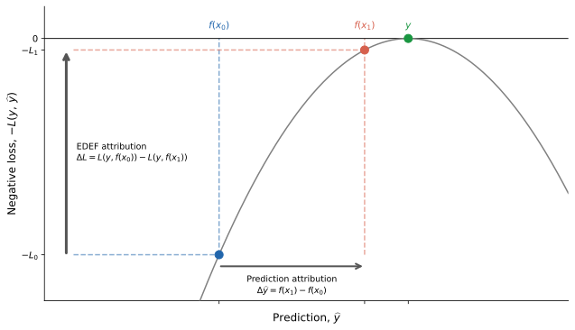

# EDEF

EDEF (Euler Decomposition of Explained Fit) decomposes realized predictive performance into additive feature contributions.

For each observation, EDEF returns feature attributions $\phi_j$ satisfying

$$\sum_j \phi_j = \mathcal{L}(y, f(x_0)) - \mathcal{L}(y, f(x)),$$

where $\mathcal{L}$ is the prediction loss, $x_0$ is a baseline input, $x$ is the observation, and $f(x)$ is the prediction function evaluated at $x$. A positive contribution means the feature improved realized predictive fit relative to the baseline.

Standard attribution methods explain predictions. EDEF explains whether those predictions were accurate.

EDEF applies the integrated-gradients framework of Sundararajan, Taly, and Yan (2017) to the loss function rather than the prediction, and thereby inherits the main axiomatic properties of IG — completeness, implementation invariance, and the dummy axiom — while attributing realized predictive fit rather than predicted values.

## Installation

Requires Python ≥ 3.9, NumPy, and Numba.

```bash
pip install edef
```

Optional dependencies:

```bash
pip install torch    # for TorchExplainer
pip install treeig   # for TreeExplainer
pip install shap     # for SHAP plotting compatibility
```

## Using EDEF

Although EDEF attributes model fit instead of predictions, it follows a familiar explainer pattern:

```python
import numpy as np
from sklearn.linear_model import LinearRegression
import edef

rng = np.random.default_rng(123)
X = rng.normal(size=(200, 3))
y = X @ np.array([1.0, 0.5, 0.0]) + rng.normal(scale=0.5, size=200)

model = LinearRegression().fit(X, y)
result = edef.LinearExplainer(model, feature_names=["x1", "x2", "x3"])(X, y)
print(result)
```

```text
Feature contributions
---------------------
      x1  edef= 0.979  se= 0.134  t= 7.33  share= 0.741
      x2  edef= 0.343  se= 0.064  t= 5.33  share= 0.260
      x3  edef=-0.001  se= 0.002  t=-0.40  share=-0.000
```

Unlike most attribution methods, EDEF reports standard errors and t-statistics alongside attribution values. Features that move predictions without improving accuracy show up near zero.

Although based on integrated gradients, EDEF only requires numerical differentiation and integration for smooth nonlinear models. This tends to be fast when automatic differentiation is available. For linear models, EDEF implements very fast analytical solutions. For tree-based models, where integrated gradients may feel mismatched, EDEF exploits the insight from TreeIG that integrated gradients are a equal to the sum of discrete prediction changes along the integration path.

## Why EDEF?

The figure illustrates the distinction between prediction-attribution methods and EDEF for mean-squared-error loss. 

<p align="center">
  
</p>

Prediction-attribution methods answer "why did the model predict this value?" EDEF answers "which features made the model accurate here?" 

These questions have different answers. A feature can strongly influence a prediction while contributing nothing to predictive accuracy, or can actively hurt it. This happens when a feature moves predictions in the wrong direction, when a feature is overfit, or when a feature captures real signal on average but adds noise on a particular evaluation sample.

Consider a model trained to predict financial returns. Feature A captures a persistent signal; feature B was correlated with returns in the training set but is uncorrelated in the evaluation period. Both features generate large prediction movements. SHAP or Integrated Gradients assigns large importances to both. EDEF assigns large importance to A and near-zero importance to B because B's prediction movements do not improve realized fit in the evaluation sample.

The distinction matters most where prediction accuracy is the natural object of interest: in model monitoring, out-of-sample validation, feature selection, overfit detection, and scientific settings where fit to held-out outcomes is the standard of evidence. The practical differences can be small when predictions are highly accurate but are often large when models are imperfect.

## How EDEF works

EDEF applies the path-integral perspective of Integrated Gradients — but to the loss function rather than the prediction.

Along the straight-line path

$$x(t) = x_0 + t \cdot (x - x_0), \qquad 0 \le t \le 1,$$

the loss reduction from baseline to observation is

$$\mathcal{L}(y, f(x_0)) - \mathcal{L}(y, f(x)) = -\int_0^1 \frac{d}{dt} \mathcal{L}(y, f(x(t))) \quad dt.$$

By the chain rule this integral decomposes additively across features:

$$\phi_j = (x_j - x_{0,j}) \int_0^1 \left[-\frac{\partial \mathcal{L}}{\partial f} \cdot \frac{\partial f}{\partial x_j}\Bigg{|}_{x(t)}\right] dt.$$

The integrand is the prediction gradient $\partial f/\partial x_j$ multiplied by the loss gradient $\partial \mathcal{L}/\partial f$. This chain-rule factor is what distinguishes EDEF from Integrated Gradients, which integrates only the prediction gradient. For squared-error loss, $\partial \mathcal{L}/\partial f = -2(y - f(x(t)))$, so EDEF weights the prediction gradient by how wrong the prediction is at each point along the path. Features that move predictions toward the truth accumulate positive contributions; features that move predictions away accumulate negative contributions.

This integral is computed differently for each model class:

- **Linear models.** The integral has a closed form. No quadrature is needed.

- **Tree models.** Via TreeIG, the path trace gives the exact sequence of
  split crossings and prediction jumps along $x(t)$. At each crossing, the
  loss changes by a computable amount. EDEF assigns that loss change to the
  crossing feature. The result is exact — no quadrature, no approximation.

- **PyTorch models.** Automatic differentiation computes
  $\partial \mathcal{L}/\partial x_j$ at each interpolation point;
  Gauss-Legendre quadrature integrates over $t$.

- **Black-box sklearn models.** Finite-difference approximations to the loss
  gradient replace automatic differentiation; Gauss-Legendre quadrature
  integrates over $t$.

## Speed

The fundamental cost difference between EDEF and its competitors is that EDEF's cost is independent of the number of features $p$ for many cases because it exploits analytic or automatic gradients. Permutation and SAGE must answer "what if feature $j$ were absent?" for every feature separately, so their cost scales with the number of features $p$. EDEF follows a single path from $x_0$ to $x$ and integrates gradients along it in $S$ passes, with $S$ fixed regardless of how many features the model has. For linear models the integral is closed form; for tree models it is exact via TreeIG path traces; for PyTorch and black-box models, $S$ is typically 32–64.

The table illustrates computational costs using full-dataset forward passes as the main cost unit. $S$ is the number of quadrature steps; $R$ is the number of permutation repetitions per feature; $T$ is the number of SAGE coalition samples; $B$ is the background set size.

| Method | Forward passes | $p=100$, $n=10{,}000$ | $p=1{,}000$, $n=10{,}000$ |
|:---|:---|---:|---:|
| EDEF | $S$ (independent of $p$) | 50 | 50 |
| Permutation ($R=10$) | $R \cdot p$ | 1,000 | 10,000 |
| SAGE ($T=512$, $B=128$) | $T \cdot B \cdot p$ | 6,500,000 | 65,000,000 |

At $p=1{,}000$, EDEF requires 200 times fewer passes than permutation and over a million times fewer than SAGE. The gap widens with $p$.

Forward-pass counts may understate the practical wall-clock advantage because EDEF's passes can be fully vectorized over observations while permutation and SAGE run sequentially across features and coalition samples. See the timing notebook and the accompanying paper for wall-clock comparisons.

For linear models, EDEF is closed form and requires no model evaluations at all. For tree models and PyTorch models, wall-clock times are similar: the dominant cost for tree models is the TreeIG path traversal rather than model forward passes, and both complete attribution for thousands of observations on a typical model in well under a second.

## Statistical inference

Because EDEF computes a contribution $\phi_j(x_i)$ for each feature and each observation, feature importances are sample averages:

$$\bar\phi_j = \frac{1}{n} \sum_{i=1}^n \phi_j(x_i).$$

Sample averages have standard errors. EDEF reports them:

$$\widehat{\text{se}}(\bar\phi_j) = \frac{1}{\sqrt{n}} \text{sd}\bigl(\phi_j(x_1), \ldots, \phi_j(x_n)\bigr).$$

Standard errors unlock inference that most attribution methods cannot provide: t-statistics to test whether a feature's contribution is distinguishable from zero, standard errors on grouped contributions, and uncertainty quantification across resampled evaluation sets. In settings where prediction accuracy is itself the quantity of scientific interest — rather than a prediction to be explained — these inferential outputs are as important as the point estimates.

## Relation to other methods

SHAP and Integrated Gradients explain predictions. EDEF and SAGE explain realized model fit. These are fundamentally different attribution targets.

**SHAP and Integrated Gradients** ask:
> "How much does feature $j$ contribute to the prediction?"

**EDEF and SAGE** ask:
> "How much does feature $j$ contribute to realized predictive accuracy?"

The table below positions EDEF against the main alternatives along six dimensions. The columns record what each method attributes; whether the method holds the model fixed at realized inputs or evaluates it at counterfactual ones; scope (local per-observation, aggregated-local, or global); whether natural standard errors are available without resampling; and the process by which importance is allocated.

| Method | Attributes | Model fixed | Realized inputs only | Scope | Nat. SEs | Process |
|:---|:---|:---:|:---:|:---|:---:|:---|
| Coefficients | Prediction / score | ✓ | ✓ | Global | — | Local sensitivity |
| Integrated Gradients | Prediction | ✓ | — | Local | — | Continuous path |
| SHAP | Prediction | — | — | Local, aggregated | — | Discrete averaging |
| Permutation / perturbation | Prediction/Accuracy | — | — | Global | — | Discrete removal |
| SAGE | Accuracy | — | — | Global | — | Discrete averaging |
| **EDEF** | **Accuracy** | **✓** | **✓** | **Global** | **✓** | **Continuous path** |

*Model fixed*: the method conditions on the deployed model at realized inputs, without counterfactual feature removal, marginalization, or perturbation. *Realized inputs only*: the model is evaluated only at inputs derivable as convex combinations of actual observations, requiring no synthetic inputs. *Nat. SEs*: standard errors reflecting sampling variation, not Monte Carlo approximation error.

### Integrated Gradients

Integrated Gradients computes $\phi_j = (x_j - x_{0,j}) \int_0^1 \partial f(x(t))/\partial x_j dt$ — the integral of the prediction gradient along the path from $x_0$ to $x$. EDEF computes the integral of the loss gradient along the same path. They share a path, a baseline, and an integration method. They differ in exactly one thing: what is integrated.

That difference in the integrand is the full story. IG measures how much each feature moved the prediction as we interpolate from baseline to observation. EDEF measures how much each feature improved or worsened predictive accuracy as we make that same interpolation. For a perfect prediction, IG and EDEF give the same sign for every feature. For a poor prediction, features that moved the prediction in the wrong direction get negative EDEF attribution even if they get large positive IG attribution.

For a linear model with zero intercept and zero baseline, EDEF and IG agree in sign but differ in magnitude, with EDEF attributions scaled by the accuracy of the prediction. As predictions become less accurate, the two methods diverge.

### SHAP

SHAP builds attributions from discrete feature inclusion effects averaged over coalitions of other features. It does not follow a path and does not observe realized outcomes. A feature can receive large SHAP importance purely because it moves predictions strongly, regardless of whether those prediction movements correspond to actual patterns in the outcome variable.

SHAP's coalition construction is deliberately indifferent to whether predictions are accurate. The same coalition structure, the same expected-prediction baseline, and the same discrete inclusion/exclusion logic apply whether the model generalizes well or poorly. This makes SHAP a precise tool for explaining the model's behavior in input space, and an imprecise tool for evaluating that behavior against realized outcomes.

### Permutation and perturbation methods

Permutation importance — available in scikit-learn as `permutation_importance`, and implemented in various forms across the model-evaluation literature — measures how much model accuracy declines or predictions change when a feature is shuffled or removed. The question asked is: "how much does the model rely on feature $j$?"

Permutation methods can target either predictive accuracy or predictions, depending on the scoring function used. The most common application — measuring the drop in model performance when a feature's values are shuffled — is a fit-based method and sits in the same camp as SAGE and EDEF. Permutation-based SHAP, by contrast, uses permutation sampling to estimate prediction attributions. The discussion below concerns the fit-based variant. It differs from EDEF in three ways.

First, permutation methods evaluate the model at counterfactual inputs. Shuffling feature $j$ creates (feature, outcome) pairs that never occurred in the data. Whether those pairs are meaningful depends on the joint distribution of features; correlation with other features means the shuffled inputs may fall far outside the model's training support. EDEF evaluates the model only at convex combinations of two real inputs — no synthetic feature combinations are introduced.

Second, permutation methods produce a single importance score per feature with no natural observation-level decomposition. Standard errors, when reported, reflect Monte Carlo variance across permutation draws — not the sampling variation across observations that EDEF's standard errors capture.

Third, permutation importance answers a counterfactual question about feature removal: "how much worse would accuracy be if the model could not see feature $j$?" EDEF answers a realized question about feature contribution: "how much did feature $j$ contribute to accuracy on these observations, given the predictions the model actually made?" The two questions have the same answer for independent features in large samples and can diverge substantially when features are correlated or when model accuracy varies across the sample.

### SAGE

SAGE is the closest existing method to EDEF in motivation. Both measure feature contributions to realized predictive performance rather than to predictions. They differ substantially in construction.

SAGE applies Shapley-style coalition averaging to predictive performance: it measures how much each feature changes expected loss as it enters or leaves a coalition, where absent features are marginalized over a background distribution. The SAGE attribution for feature $j$ asks "how much worse would the model perform if it could not use feature $j$?" — a global counterfactual question about feature removal.

EDEF asks "how much did feature $j$ contribute to the loss reduction for this observation, along the specific path from baseline to observation?" — a local path-integral question about feature movement. The difference is analogous to the difference between SHAP and IG: Shapley-style marginalizing out features versus path-integral accumulation of gradient contributions.

Three practical consequences follow. First, EDEF requires only a baseline vector; SAGE requires a background distribution from which to marginalize out features. Second, EDEF computes observation-level contributions that aggregate naturally to sample-average importances with standard errors; SAGE produces global importance estimates without natural observation-level decompositions. Third, EDEF exploits closed-form path integrals and exact tree path traces for efficient computation; SAGE currently lacks analogous backend optimizations and can be expensive for large models.

## Available explainers

| Explainer | Intended models | Method |
|:---|:---|:---|
| `LinearExplainer` | Linear and generalized linear models | Closed-form exact decomposition |
| `TorchExplainer` | PyTorch neural networks | Autograd + Gauss-Legendre quadrature |
| `TreeExplainer` | Tree ensembles | Exact TreeIG path traces |
| `NumericalExplainer` | Any sklearn-style model | Finite-difference + Gauss-Legendre quadrature |

## Supported models

### Linear models

- Linear regression
- Binary logistic regression
- Multiclass logistic regression

### PyTorch models

- Regression (squared-error loss)
- Binary classification (log loss)
- Multiclass classification (softmax log loss)

### Tree models (via TreeIG)

- `sklearn.tree.DecisionTreeRegressor`
- `sklearn.ensemble.RandomForestRegressor`
- `sklearn.ensemble.ExtraTreesRegressor`
- `sklearn.ensemble.GradientBoostingRegressor`
- `sklearn.ensemble.GradientBoostingClassifier`
- `xgboost.XGBRegressor`, `xgboost.XGBClassifier`, `xgboost.Booster`
- `lightgbm.LGBMRegressor`, `lightgbm.LGBMClassifier`, `lightgbm.Booster`

Tree classification uses raw margins/logits rather than predicted probabilities. Probabilities are not additive across trees.

### Numerical black-box models

Any model with `predict(X)` (regression) or `predict_proba(X)` (classification), including sklearn pipelines and `MLPRegressor`/ `MLPClassifier`.

## Not currently supported

- probability-output tree attribution;
- missing-value tree routing;
- CatBoost.

## Examples for Different Models

Runnable example scripts are available in [`examples/`](examples/):

- [`linear_regression_basic.py`](examples/linear_regression_basic.py)  
  Linear regression EDEF decomposition with grouped contributions and
  additivity diagnostics.

- [`linear_logistic_basic.py`](examples/linear_logistic_basic.py)  
  Binary logistic regression using log-loss decomposition.

- [`tree_regression_basic.py`](examples/tree_regression_basic.py)  
  Exact TreeIG-based EDEF decomposition for tree regression models.

- [`tree_classification_basic.py`](examples/tree_classification_basic.py)  
  Exact TreeIG-based EDEF decomposition for binary and multiclass tree
  classification models.

- [`torch_regression_basic.py`](examples/torch_regression_basic.py)  
  Path-integral EDEF decomposition for PyTorch regression models.

- [`torch_classification_basic.py`](examples/torch_classification_basic.py)  
  Binary and multiclass PyTorch classification with log-loss decomposition.

- [`numerical_regression_basic.py`](examples/numerical_regression_basic.py)  
  Numerical finite-difference EDEF decomposition for black-box regression
  models.

- [`numerical_classification_basic.py`](examples/numerical_classification_basic.py)  
  Numerical finite-difference EDEF decomposition for black-box classification
  models.

### Linear regression

```python
import numpy as np
from sklearn.linear_model import LinearRegression
import edef

model = LinearRegression().fit(X, y)

explainer = edef.LinearExplainer(
    model,
    feature_names=["x1", "x2", "x3"],
)

result = explainer(X, y)

print(result.to_frame())
```

### Binary classification

```python
from sklearn.linear_model import LogisticRegression
import edef

model = LogisticRegression().fit(X, y)

explainer = edef.LinearExplainer(
    model,
    loss="log_loss",
    feature_names=["x1", "x2", "x3"],
)

result = explainer(X, y)
```

### Tree regression

```python
from sklearn.ensemble import GradientBoostingRegressor
import edef

model = GradientBoostingRegressor(
    n_estimators=100,
    max_depth=3,
).fit(X, y)

explainer = edef.TreeExplainer(
    model,
    baseline=X.mean(axis=0),
    loss="squared_error",
)

result = explainer(X_eval, y_eval)
```

EDEF uses TreeIG to compute the exact sequence of split-crossing events
along the interpolation path for each observation. Each crossing changes
the model prediction, which changes the loss. EDEF assigns the resulting
loss change to the crossing feature. For supported TreeIG models, the
decomposition is exact up to floating-point error.

### Tree classification

```python
from sklearn.ensemble import GradientBoostingClassifier
import edef

model = GradientBoostingClassifier(...).fit(X, y)

explainer = edef.TreeExplainer(
    model,
    baseline=X.mean(axis=0),
    loss="log_loss",
)

result = explainer(X_eval, y_eval)
```

For multiclass models, use `loss="multiclass_log_loss"`. EDEF merges the
split-crossing sequences across all class-margin trees and applies the
corresponding softmax log-loss changes at each event.

### PyTorch models

```python
import edef

explainer = edef.TorchExplainer(
    model,
    baseline=X_train.mean(axis=0),
    loss="squared_error",   # or "log_loss", "multiclass_log_loss"
    n_steps=50,
    feature_names=["x1", "x2", "x3"],
)

result = explainer(X_eval, y_eval)
```

### Black-box sklearn models

```python
from sklearn.neural_network import MLPRegressor
from sklearn.pipeline import make_pipeline
from sklearn.preprocessing import StandardScaler
import edef

model = make_pipeline(
    StandardScaler(),
    MLPRegressor(...),
).fit(X, y)

explainer = edef.NumericalExplainer(
    model,
    baseline=X.mean(axis=0),
    loss="squared_error",
    n_steps=32,
    feature_names=["x1", "x2", "x3"],
)

result = explainer(X_eval, y_eval)
```

### Grouped contributions

Grouped contributions preserve exact additivity by summing feature-level
contributions within user-defined groups.

This is useful for:

- one-hot encoded variables;
- embedding blocks;
- sector or factor groups;
- hierarchical feature structures.

```python
grouped = result.group(
    ["signal", "signal", "noise"]
)

print(grouped.to_frame())
```

### Explanation utilities

```python
print(result)

frame = result.to_frame()

ax = result.plot(max_features=10)

shap_values = result.to_shap_explanation(data=X_eval)
```

The returned `EDEFExplanation` object contains:

- average feature contributions;
- observation-level contributions;
- standard errors;
- t-statistics;
- proportional contributions;
- baseline and model losses;
- additivity diagnostics.

## Accessing results

```python
result.values            # feature contributions (point estimates)
result.standard_errors   # standard errors
result.t_values          # t-statistics: values / standard_errors
result.proportions       # share of total explained fit
result.to_frame()        # pandas DataFrame, sorted by contribution
result.plot()            # horizontal bar chart with confidence intervals
```

Standard errors are computed from the observation-level contributions
and scale correctly under grouping.

## SHAP plotting

```python
shap_exp = result.to_shap_explanation(data=X)

import shap
shap.plots.beeswarm(shap_exp)
```

The underlying values are EDEF realized-fit contributions. The SHAP plotting interface is used for visualization only.

## Project status

EDEF covers the dominant regression and classification models in the Python ecosystem with exact or high-accuracy decompositions:

- closed-form exact attribution for linear models;
- autograd path integration for PyTorch models;
- exact attribution for tree ensembles via TreeIG;
- numerical attribution for any sklearn-interface model;
- multiclass log-loss decomposition throughout;
- observation-level contributions with standard errors and t-statistics;
- grouping, SHAP-compatible plotting, and pandas output.

## References

EDEF:

- Hentschel, Ludger. 2026.
  "Feature importance for model fit: Nonlinear regression and
  classification in machine learning models."

- Hentschel, Ludger. 2026.
  "Feature importance for predictive accuracy: An Euler decomposition."

TreeIG:

- Hentschel, Ludger. 2026.
  "TreeIG: Exact Integrated Gradients for Tree-Based Models."

Integrated Gradients:

- Sundararajan, Mukund, Ankur Taly, and Qiqi Yan. 2017.
  "Axiomatic Attribution for Deep Networks."
  *International Conference on Machine Learning (ICML).*

SHAP and TreeSHAP:

- Lundberg, Scott M., and Su-In Lee. 2017.
  "A Unified Approach to Interpreting Model Predictions."
  *Advances in Neural Information Processing Systems (NeurIPS).*

- Lundberg, Scott M., Gabriel Erion, and Su-In Lee. 2020.
  "From Local Explanations to Global Understanding with Explainable AI
  for Trees."
  *Nature Machine Intelligence.*

SAGE:

- Covert, Ian, Scott Lundberg, and Su-In Lee. 2020.
  "Understanding Global Feature Contributions With Additive Importance
  Measures."
  *NeurIPS.*

Permutation importance:

- Breiman, Leo. 2001.
  "Random Forests."
  *Machine Learning* 45(1): 5–32.

- Louppe, Gilles, Louis Wehenkel, Antonio Sutera, and Pierre Geurts. 2013.
  "Understanding Variable Importances in Forests of Randomized Trees."
  *Advances in Neural Information Processing Systems (NeurIPS).*

## License

BSD 3-Clause License.